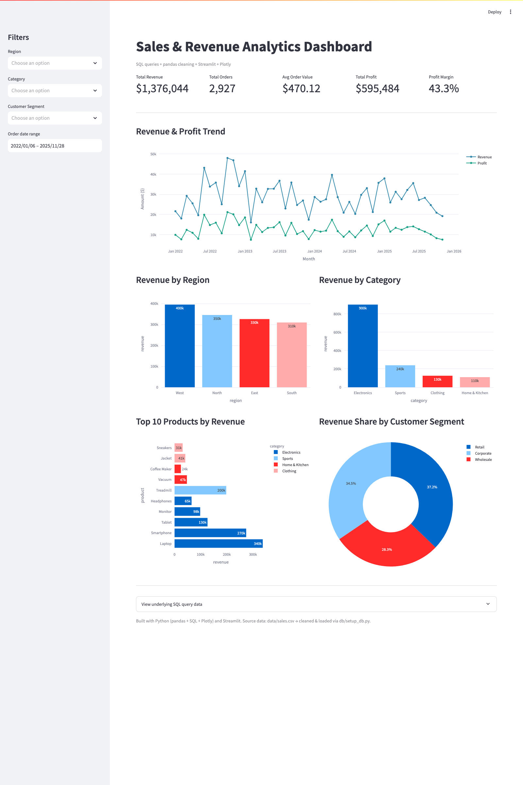

# Sales & Revenue Analytics Dashboard

An end-to-end data analysis project that takes raw sales data through the full
analytics pipeline: **Python (pandas) for cleaning → SQL for querying →
interactive dashboard (Streamlit + Plotly)**.



## Project Overview

| Stage          | Tool / Skill                         |
|----------------|--------------------------------------|
| Data generation | Python (`generate_data.py`)         |
| Data cleaning   | Python + pandas (`db/setup_db.py`)  |
| Data storage    | SQLite (schema + materialized views)|
| Querying        | SQL (SQLite)                        |
| Visualization   | Plotly                              |
| Dashboard       | Streamlit                           |

## What it answers

- What is **total revenue, profit, avg order value** — and how do they trend?
- Which **region / category / customer segment** drives the most revenue?
- Which are the **top products** and where should you focus?
- **Filterable** by region, category, customer segment, and date range.

## Project Structure

```
├── generate_data.py      # creates raw data/sales.csv
├── db/
│   └── setup_db.py       # pandas cleaning -> SQLite with views
├── data/
│   ├── sales.csv         # raw data
│   └── sales.db          # cleaned SQLite database
├── app.py                # Streamlit dashboard
├── requirements.txt
└── .streamlit/config.toml
```

## Run it locally

```bash
# 1. Install dependencies
pip install -r requirements.txt

# 2. (Re)generate the raw data + rebuild the database
python generate_data.py
python db/setup_db.py

# 3. Launch the dashboard
streamlit run app.py
```

Open http://localhost:8501

## Live demo

Deployed on Streamlit Community Cloud:
**https://sales-analytics-dashboard.streamlit.app**

## Why this project stands out

- Covers the **full pipeline** recruiters ask for: cleaning → storage → SQL → viz
- Real **SQL queries** power the KPIs, not hardcoded numbers
- Interactive filters make it easy to explore any slice of the data
- The requirements file + this README are config that would be maintained by a real team

## License

MIT